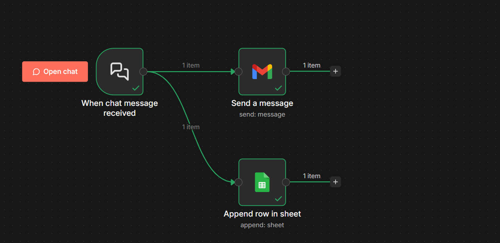

# n8n-automation-portfolio
Portfolio für Workflow-Automatisierung mit n8n.
Fokus auf API-Integrationen, Datenverarbeitung und stabile Automationsprozesse.

Use Case

Automatisierte Verarbeitung eingehender Chat-Daten mit Weiterleitung per E-Mail und Speicherung in Google Sheets.

Workflow: Chat → Email → Google Sheets
Ziel

Automatisierte Weiterleitung und strukturierte Datenspeicherung zur Reduzierung manueller Arbeit.
Der Workflow ist modular aufgebaut und für reale Integrationsszenarien konzipiert.

**Ablauf**

- Webhook empfängt Chat-Daten
- Datenverarbeitung und Strukturierung
- Automatischer E-Mail-Versand
- Speicherung in Google Sheets
- Fehlerhandling mit Retry-Logik

**Technische Schwerpunkte**

- Webhook-basierte Datenaufnahme
- API-Integration (Google Sheets, Email)
- Fehlerbehandlung und Wiederholversuche
- Saubere, wartbare Node-Struktur
- Erweiterbar für zusätzliche Systeme

**Setup**

- Workflow-JSON in n8n importieren
- Email-Credentials konfigurieren
- Google-Sheets-Credentials verbinden
- Webhook aktivieren
- Testdaten senden

**Technologien**

- n8n
- Webhooks / REST
- Google Sheets API
- Email Integration

**Hinweis**

Credentials und API-Keys sind nicht im Repository enthalten und müssen lokal in n8n konfiguriert werden.

